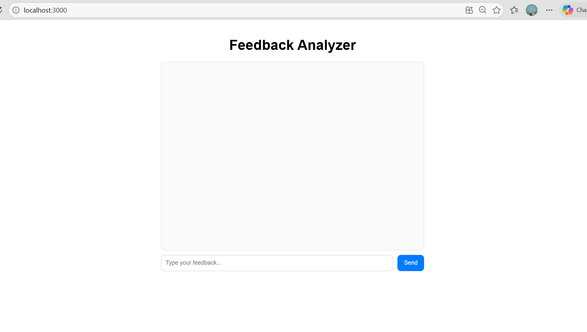
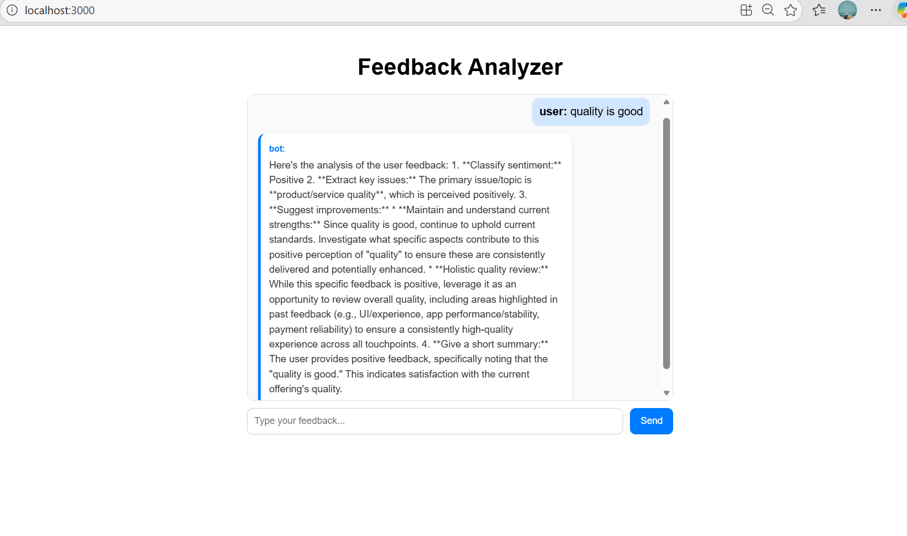
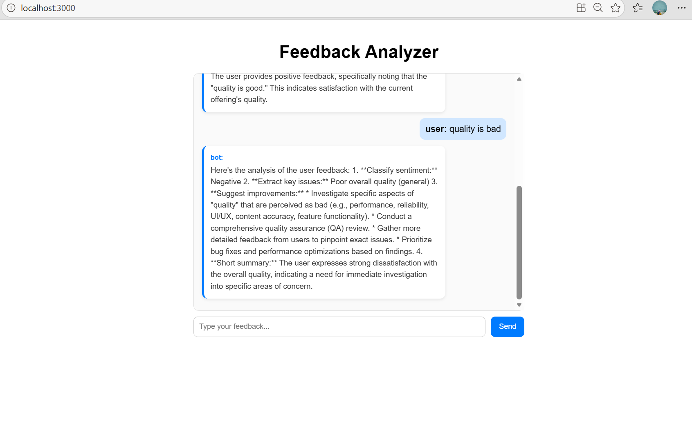

# FRONTEND README.md

# Feedback Analyzer Frontend

**React-based UI** for an AI-powered feedback analysis system. Users can submit feedback and receive structured insights including sentiment, key issues, improvements, and summary in a clean chat interface.

---

## Features

- Chat-based UI
- Structured response rendering (cards)
- Dynamic message updates
- Responsive design

---

## Tech Stack

- React
- Axios
- CSS

---
## Dependencies

- **React**

    React is a JavaScript library used to build user interfaces (UI), especially for single-page applications.
- **Axios**

    Axios is a JavaScript library used to make HTTP requests from the frontend to a backend server or API.
- **CSS (Cascading Style Sheets)**

    CSS is a stylesheet language used to style and design web pages.
---
## Project Structure
```
frontend/
│── src/
│ ├── App.js
│ ├── services/api.js
│ ├── styles/app.css
```
---

# 2. Install Dependencies

**Terminal**
- npm **create-react-app "project_name"**

---
## Run App
```
command : npm start


App runs at:
http://localhost:3000

---

##  API Integration

Make sure backend is running at:
http://127.0.0.1:8000/


Update API URL if needed in:
src/services/api.js

```
# Ouput
---



